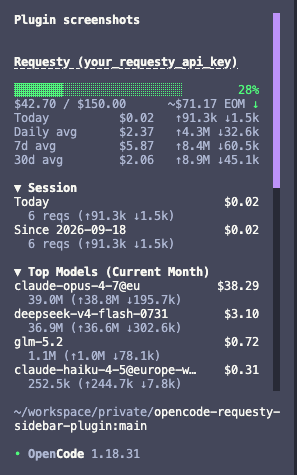
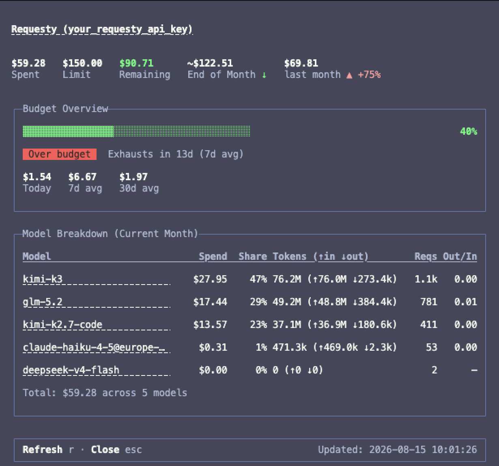
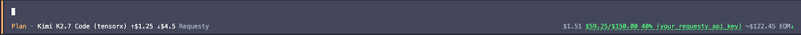

# opencode-requesty-plugin

An [opencode](https://opencode.ai) TUI plugin that shows your [Requesty.ai](https://www.requesty.ai) budget, current monthly spend, and per-model cost distribution right in the session prompt, in the session sidebar, plus a detail dialog via the `/requesty` slash command.

## Features

The plugin surfaces your Requesty.ai budget and usage in three places, each optimized for the space it occupies: a compact sidebar, a full detail dialog, and a minimal prompt-area readout.

### Sidebar widget



The sidebar gives a quick, at-a-glance view of your current month's Requesty usage:

- Monthly spend and monthly limit, pulled from `GET /v1/manage/apikey/self`
- A color-coded progress bar that turns yellow/red at configurable thresholds
- Projected month-end spend at the current run rate (`~$X EOM`), with a pace marker: ↑ over pace, → on pace, ↓ under pace
- Daily spend trend: today · 7-day average · 30-day average
- API key name in the header, linking to the Requesty analytics dashboard filtered by that key
- Top models for the current month (up to `sidebar.maxModels`), each with spend, total tokens, and input (↑) / output (↓) breakdown

You can disable the sidebar entirely with `"sidebar": { "enabled": false }`.

### Detail dialog



Open the dialog with `/requesty` or by picking *Requesty: show usage* from the command palette for the full breakdown:

- KPI row: spent, limit, remaining, End of Month projection with a colored pace arrow, and last month's spend with a colored trend chevron
- *Budget Overview* card: wide progress bar, budget-health badge, days-to-exhaustion estimate based on your 7-day average, and today/7d/30d averages
- *Model Breakdown (Current Month)* card: per-model table with spend, share of total spend, tokens, request count, and output/input ratio

### Prompt indicator



A compact readout on the right side of the session prompt shows:

- Today's spend
- Spend vs. limit with percentage and API key name, colored by the same thresholds as the sidebar
- Optional month-end projection (`~$X EOM ↑`) when `prompt.monthlyProjection` is enabled

Disable the readout with `"prompt": { "budgetIndicator": false }`.

Data comes from the [Requesty Management API](https://docs.requesty.ai/api-reference/management-apis) (`apikey/self` + `apikey/self/usage` grouped by `model_used`, current calendar month).

## Installation

Add the plugin to your `tui.json` (project root or `~/.config/opencode/tui.json`):

```json
{
  $schema": "https://opencode.ai/tui.json",
  "plugin": ["@christiangalsterer/opencode-requesty-plugin"]
}
```

Or with options:

```json
{
  $schema": "https://opencode.ai/tui.json",
  "plugin": [
    [
      "@christiangalsterer/opencode-requesty-plugin",
      {
        "refreshIntervalMs": 300000,
        "sidebar": {
          "enabled": true,
          "maxModels": 5,
          "order": 50
        },
        "warningThreshold": 0.6,
        "errorThreshold": 0.85
      }
    ]
  ]
}
```

Restart opencode after changing the config — plugins are loaded at startup.

### Local development install

Point at a local checkout instead:

```json
{
  "plugin": ["file:///absolute/path/to/opencode-requesty-plugin/dist/tui.tsx"]
}
```

Run `bun install && bun run build` in the checkout first.

## API key detection

The plugin reads your Requesty API key from the opencode provider config: `provider.requesty.options.apiKey` in `opencode.json`, including `{env:VAR}` interpolation.

```json
{
  "provider": {
    "requesty": {
      "options": { "apiKey": "sk-..." }
    }
  }
}
```

Or via an environment variable:

```json
{
  "provider": {
    "requesty": {
      "options": { "apiKey": "{env:REQUESTY_API_KEY}" }
    }
  }
}
```

If no key is found, the widget shows a short setup hint instead of failing.

## Configuration

### Configuration options

| Option | Type | Default | Description |
| ------ | ---- | ------- | ----------- |
| `refreshIntervalMs`       | number  | `300000` (5 min)             | Periodic refresh interval (safety net) |
| `warningThreshold`        | number  | `0.7` (70%)                  | Budget usage ratio at which the bar turns yellow (accepts 0–1 or 0–100) |
| `errorThreshold`          | number  | `0.9` (90%)                  | Budget usage ratio at which the bar turns red (accepts 0–1 or 0–100) |
| `sidebar.enabled`         | boolean | `true`                       | Show the sidebar widget |
| `sidebar.maxModels`       | number  | `5`                          | Number of models shown in the compact sidebar list |
| `sidebar.order`           | number  | `50`                         | Slot order for the sidebar widget; lower numbers appear first |
| `prompt.enabled`          | boolean | `true`                       | Show the prompt widget |
| `prompt.budgetIndicator`  | boolean | `true`                       | Show spend/limit readout on the right side of the session prompt |
| `prompt.dailySpend`       | boolean | `true`                       | Show today's spend to the left of the budget indicator in the session prompt |
| `prompt.monthlyProjection`| boolean | `true`                       | Show a month-end projection (`~$X EOM ↑`) in the session prompt, red when the estimated spend exceeds the budget |
| `prompt.order`            | number  | `50`                         | Slot order for the prompt indicator; lower numbers appear first |

`warningThreshold` must be lower than `errorThreshold`; if the ordering is invalid, both fall back to the defaults (70%/90%). Values above `1` are treated as percents, e.g. `80` means 80%.

### Complete configuration example

```json
{
  "$schema": "https://opencode.ai/tui.json",
  "plugin": [
    [
      "@christiangalsterer/opencode-requesty-plugin",
      {
        "refreshIntervalMs": 300000,
        "sidebar": {
          "enabled": true,
          "maxModels": 5,
          "order": 50
        },
        "warningThreshold": 0.7,
        "errorThreshold": 0.9,
        "prompt": {
          "enabled": true,
          "budgetIndicator": true,
          "dailySpend": true,
          "monthlyProjection": true,
          "order": 50
        }
      }
    ]
  ]
}
```

Data is refreshed on startup, on a periodic interval, when a new session is created, and when messages are updated.

## Requirements

- opencode ≥ 1.18 (TUI plugin API with slots)
- A Requesty API key — create one at [app.requesty.ai/api-keys](https://app.requesty.ai/api-keys)

## Development

```bash
bun install
bun run typecheck   # tsc --noEmit over src/ and test/
bun test            # unit tests via bun:test
bun run build       # copy src/* → dist/
```

The project is fully typed TypeScript (`strict` mode). Sources live in `src/` (`.ts`/`.tsx`), tests in `test/`. The opencode host transforms TSX at load time via `@opentui/solid/preload` (Bun); no bundler is used.

## License

MIT
